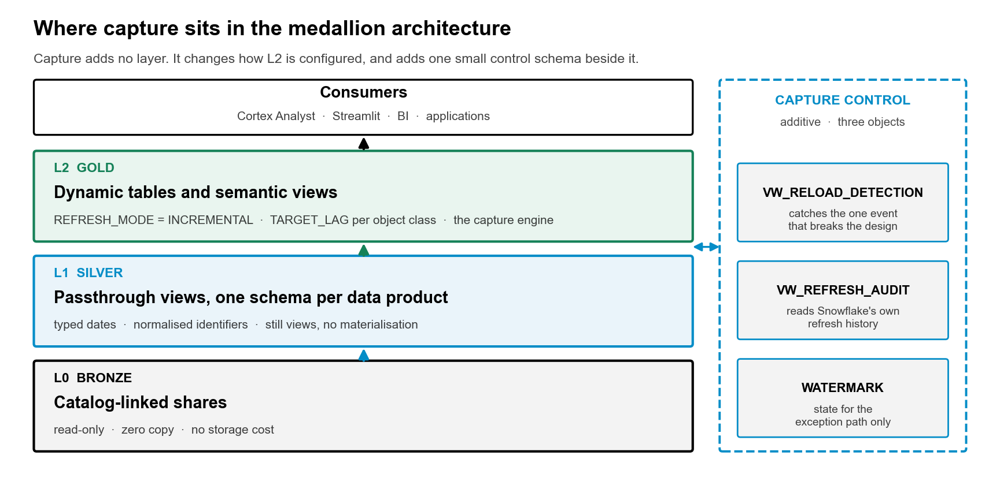

# SAP BDC Medallion + CDC — a Cortex Code skill

A [Cortex Code](https://docs.snowflake.com/en/user-guide/cortex-code/cortex-code)
skill that builds **change data capture and a Bronze / Silver / Gold medallion**
over SAP Business Data Cloud data products shared into Snowflake as
catalog-linked (zero-copy) databases.

You ask Cortex Code something like *"build CDC and a medallion over the
CUSTOMER_V1 share"*. The skill then:

1. finds the catalog-linked databases and assesses CDC readiness (standard or custom track)
2. profiles the share: row counts, flow hash, **masked columns**, indicator-column types
3. drafts a config, then **verifies every key** as the role that will run capture
4. renders deterministic SQL from the config — control plane, Bronze views,
   incremental Silver dynamic tables, Gold, operations
5. deploys after you approve, and proves it: metadata validation, two capture
   cycles, reconciliation, `INCREMENTAL` on every dynamic table
6. leaves two **suspended** tasks to poll and to run daily assurance



## Install

```bash
cortex skill add sfc-gh-dfreriks/sap-bdc-medallion-cdc-skill
pip install -r ~/.snowflake/cortex/skills/sap-bdc-medallion-cdc/requirements.txt   # path shown by `cortex skill list`
```

Then in Cortex Code:

```
$sap-bdc-medallion-cdc build CDC over my SAP BDC customer share
```

or just describe the task — *"incremental capture from my BDC catalog-linked database"*,
*"Silver and Gold dynamic tables on SAP BDC data"* — and the skill triggers.

Prerequisites: a Snowflake connection, a warehouse, one or more catalog-linked
databases from BDC Connect, Python 3.10+.

## Why a skill, and not just SQL

Capture on a BDC share is mostly about avoiding failures that **do not raise an
error**. Each one below was measured on a live share, and each has a gate in
the workflow:

| silent failure | what happens | gate |
| --- | --- | --- |
| a key column is **masked** for the role that owns Silver | every key reads `********`; Silver collapses to one row per masked value | `verify_grain.py --role` → `BLOCKED` |
| a merge key is one part short | rows are silently discarded (39,462 → 14,017 on one object) | `verify_grain.py` → `FAIL` |
| reading a **copy** of a share | connector metadata corrupted on every copy tested | profile warns; templates require a flow hash |
| `__TIMESTAMP` cast without fixing its comma decimal | every value parses to NULL | handled in Bronze |
| `REFRESH_MODE = AUTO` | silent fallback to FULL; bigger bill, longer lag | always `INCREMENTAL` |
| `COALESCE(<boolean>, '')` on an indicator | fails at first refresh, leaving a broken object | profile prints types |
| `GRANT SELECT ON ALL TABLES` on a CLD | grants nothing — they are Iceberg tables; refresh fails as owner | documented minimum grants |
| SAP re-publishes instead of sending deltas | stays correct, gets expensive | `VW_RELOAD_DETECTION` |
| a hard delete the share never labels | invisible | daily `SP_RECONCILE` |

## What gets built

```
<TARGET_DB>
  CAPTURE_CONTROL   WATERMARK registry · METADATA_VALIDATION · REFRESH_AUDIT · RECONCILIATION · OBJECT_BASELINE
                    SP_VALIDATE_METADATA · SP_POLL_OBJECT · SP_CAPTURE_CYCLE · SP_RECONCILE · SP_DAILY_ASSURANCE
                    VW_CAPTURE_HEALTH · VW_FRESHNESS · VW_RELOAD_DETECTION · VW_REFERENTIAL_INTEGRITY · VW_REFRESH_HISTORY
                    TSK_CAPTURE_CYCLE (suspended) · TSK_DAILY_ASSURANCE (suspended)
  BRONZE            V_<object> zero-copy views · VW_SHARE_INVENTORY
  SILVER            DT_<object> dynamic tables, REFRESH_MODE = INCREMENTAL, de-duplicated on the verified grain
  GOLD              your marts (worked example: DIM_CUSTOMER_360, BRG_CUSTOMER_SALES_AREA)
```

The poll reads `MAX()` of the replication watermark **as text**, which Iceberg
manifest statistics answer without scanning data, so checking every 15 minutes
costs almost nothing. Dynamic tables refresh only when the watermark moved.

## Repository layout

```
skills/sap-bdc-medallion-cdc/
  SKILL.md                     the workflow Cortex Code follows, with approval stops
  scripts/
    profile_share.py           discover CLDs, profile one, draft config.yaml
    verify_grain.py            rows vs distinct keys, masking check, as a given role
    render_sql.py              config.yaml -> 10_control … 50_ops.sql (no connection needed)
    run_sql.py                 deploy files in order; handles $$ procedure bodies
    readiness/                 CDC readiness probe (from sap-bdc-cdc)
  templates/                   Jinja templates for the generated SQL
  config/example.yaml          annotated config schema
  references/                  masking & privileges, layer rules, both CDC tracks, gaps
  examples/customer-master/    CUSTOMER_V1: config, Gold template, generated SQL, test results
assets/                        diagrams
```

## Use it without Cortex Code

Everything is plain Python and SQL:

```bash
cd skills/sap-bdc-medallion-cdc
pip install -r requirements.txt
python3 scripts/profile_share.py --connection <conn> --database <CLD> --out work/config.yaml --guess-keys
# edit work/config.yaml: keys, classes, flags
python3 scripts/verify_grain.py work/config.yaml --connection <conn> --role <capture_role>
python3 scripts/render_sql.py work/config.yaml --out work/generated
python3 scripts/run_sql.py --connection <conn> --role <capture_role> --warehouse <wh> --dir work/generated
```

## Related

- [sap-bdc-cdc](https://github.com/sfc-gh-dfreriks/sap-bdc-cdc) — the measured
  evidence behind the pattern, white paper and collateral
- The `sap-bdc-cdc-recommendation` skill — produces the CDC enablement
  recommendation deliverables for a tenant

## Caveats

This is a community pattern, not a Snowflake product commitment, and not
endorsed by SAP. Verify on your own tenant before relying on it.

- **Deletes are unverified on the standard track.** No delete code has been seen
  in `__OPERATION_TYPE`. Dynamic tables still remove physically deleted rows,
  and reconciliation runs daily.
- **Deltas on a live share were not observed.** A refresh driven by a new
  connector write was tested only on a custom-track stand-in made of native
  tables.
- **Masking and grants vary by tenant.** Masking policies and their unmask tags
  are set per tenant. Who may see PII is a governance decision for you to make;
  this skill doesn't make it.

Apache 2.0 — see [LICENSE](LICENSE).
